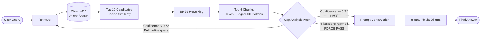

# BubbleHead

A local RAG (Retrieval Augmented Generation) pipeline that lets you query your own documents using a locally running LLM. No data leaves your machine.

---

## Pipeline



---

## How It Works

### 1. Ingestion

Documents are parsed, chunked, embedded, and stored before any queries are run.

**Supported formats:**

| Format | Parser |
|--------|--------|
| PDF | PyMuPDF / pdfplumber |
| DOCX | python-docx |
| PPT / PPTX | python-pptx |
| TXT | Native Python |
| HTML | BeautifulSoup4 |
| CSV | Pandas |

**Chunking Strategy: Hybrid (Semantic + Recursive)**

The chunker first splits on paragraph, sentence, and word boundaries to avoid mid sentence cuts. For long form documents, consecutive sentences with similar embeddings are grouped together. Each chunk is 512 tokens with a 50 token overlap to preserve context across boundaries.

Metadata stored per chunk: source file, page number, chunk index, section heading, document type.

Special handling:
* Code blocks are kept intact and tagged `type: code`
* Tables are never split mid row
* PowerPoint slides are chunked one slide at a time

Each chunk is embedded into a dense vector using Ollama and stored in ChromaDB alongside the raw text.

---

### 2. Retrieval

When a query comes in, it is converted into a dense vector and compared against every stored chunk using cosine similarity. The top 10 nearest chunks are returned as an initial candidate pool.

These 10 candidates are then rescored using BM25, which ranks on exact term overlap. This catches specific names, dates, acronyms, and technical terms that semantic search alone might miss. The top 6 chunks from the reranked list move forward.

A 5000 token budget is enforced. Chunks are added in rank order, and selection stops the moment adding the next chunk would push the total over the limit. This keeps the context window predictable regardless of how chunk sizes vary.

---

### 3. Gap Analysis Agent

Before anything reaches the LLM, the gap analysis agent checks whether the retrieved chunks actually answer the question.

The agent reads the original query and all retrieved passages, then produces a confidence score between 0 and 1. The score reflects how completely the context addresses the question.

* **Score >= 0.72** PASS. Moves straight to generation.
* **Score < 0.72** FAIL. The agent identifies what is missing, rewrites the query to target that gap, and triggers another retrieval pass. The new chunks are added to the accumulated context.

This loop runs up to 4 times. On each iteration, the agent scores the full accumulated context, not just the latest batch. If the score never crosses 0.72 after 4 passes, the system issues a FORCE PASS and sends what it has to the LLM along with a note about what could not be found.

---

### 4. Generation

The LLM receives the user's question and the retrieved chunks formatted as numbered passages. It is instructed to answer strictly from those passages, cite which passage supports each claim, and not draw on any prior knowledge.

Model settings:

| Parameter | Value |
|-----------|-------|
| Model | mistral:7b (Ollama) |
| Temperature | 0.3 |
| Top K chunks | 6 |
| Token budget | 5000 |

The response is passed back through the LangGraph state and returned to the user.

---

## Setup

**Requirements:** Python 3.11, [Ollama](https://ollama.com) installed and running locally.

**Pull the model:**
```bash
ollama pull mistral:7b
```

**Install dependencies:**
```bash
pip install -r requirements.txt
```

---

## Dependencies

```
# Orchestration
langchain-core==0.3.5
langchain-community==0.3.2
langgraph==0.2.14
ollama==0.2.1

# Vector store
chromadb==0.5.5

# Document parsing
pymupdf==1.24.10
python-docx==1.1.2
python-pptx==0.6.23

# Utilities
numpy==1.26.4
pandas==2.2.2
```
